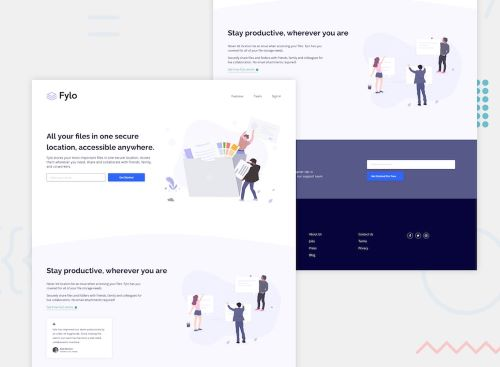

# Fylo Landing Page - Web Development Project

This repository contains a web development solution for the Fylo landing page challenge on Frontend Mentor. Frontend Mentor challenges offer valuable opportunities to enhance coding skills by working on real-world projects.

## Table of Contents

- [Overview](#overview)
- [Live Demo](#live-demo")
- [Technologies Used](#technologies-used)
- [Key Takeaways](#key-takeaways)
- [Future Development](#future-development)
- [Author](#author)
- [Acknowledgments](#acknowledgments)
- [License](#license)

## Overview 

This project involves the development of a landing page for Fylo, a concept company that provides cloud storage solutions for various file types. The landing page prominently features the Call to Action, outlines the benefits of the service, and provides insights into the team behind Fylo.

(<a href="#readme-top">Back to Top</a>)

### Live Demo 

You can explore the live demo of the Fylo landing page by clicking the link below:

- [Live Demo](https://nelfylo.netlify.app/)

(<a href="#readme-top">Back to Top</a>)

## Technologies Used 

- HTML5
- CSS (including custom properties)
- Responsive design utilizing Flexbox and CSS Grid
- JavaScript
- Webpack 5

(<a href="#readme-top">Back to Top</a>)

## Key Takeaways 

Throughout the development of this project, several web development concepts and techniques were learned. Key takeaways from this project include:

- The implementation of responsive design to cater to various screen sizes.
- Effective utilization of HTML, CSS, and JavaScript to create interactive web pages.
- Integration of Webpack 5 for bundling and optimizing the project.

(<a href="#readme-top">Back to Top</a>)

## Future Development 

In future projects, the focus will be on further development in the following areas:

- Exploring JavaScript for enhanced interactivity.
- Implementing optimization techniques for improved web page loading times.
- Continued practice in creating responsive and visually appealing web designs.

(<a href="#readme-top">Back to Top</a>)

## Author 

- Frontend Mentor - [@lily4178993](https://www.frontendmentor.io/profile/lily4178993)
- LinkedIn - [Nelly T.](https://www.linkedin.com/in/nellytelli)

(<a href="#readme-top">Back to Top</a>)

## Acknowledgments 

I express my gratitude to the following resources that were particularly helpful in this project:

- [Frontend Mentor](https://www.frontendmentor.io) - For providing the Fylo landing page challenge that inspired this project.
- [Icon8](https://www.icon8.com) - For providing the favicon used on the site.

(<a href="#readme-top">Back to Top</a>)

## License 

This project is licensed under the [MIT License](./LICENSE).

(<a href="#readme-top">Back to Top</a>)

